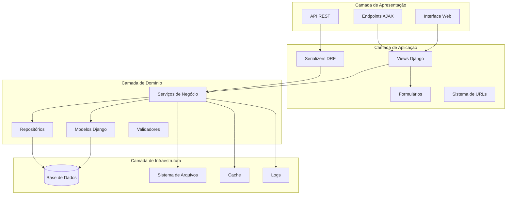
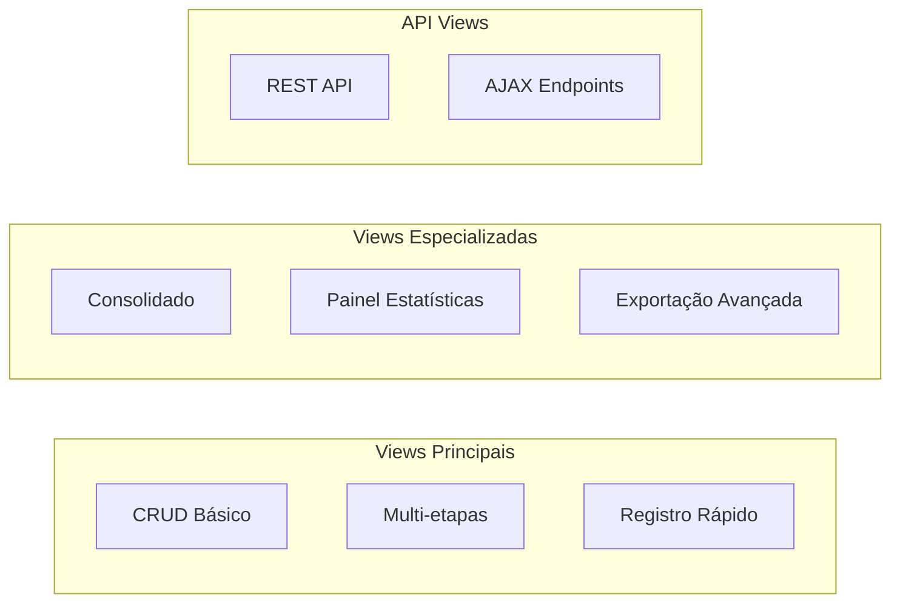
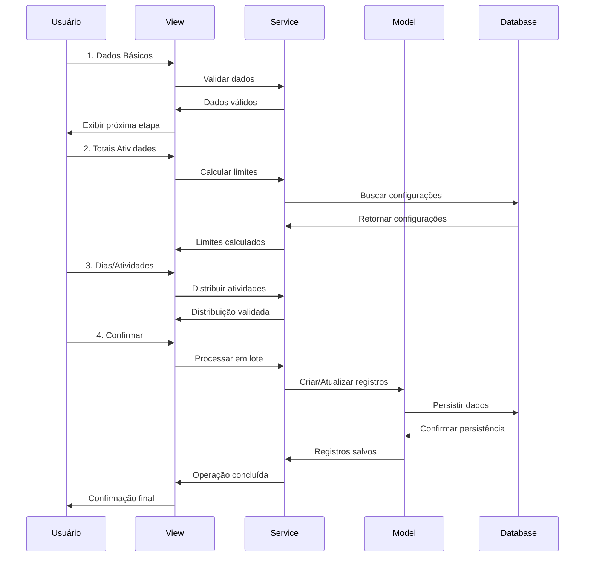
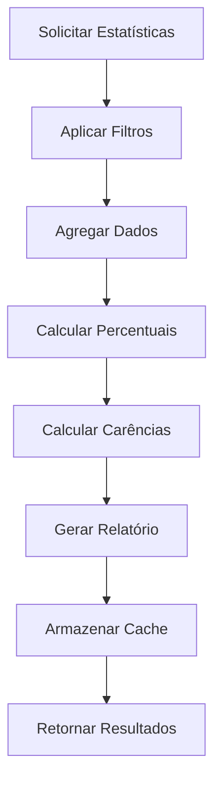

# Arquitetura do Sistema de Presenças

## Visão Geral

O sistema de presenças do OMAUM é um módulo Django abrangente para controle e gestão de frequência de alunos em atividades acadêmicas e ritualísticas. A arquitetura foi projetada seguindo os princípios de **Clean Architecture** e **Domain-Driven Design**, garantindo alta escalabilidade, manutenibilidade e testabilidade.

## Arquitetura Geral



## Componentes Principais

### 1. Modelos de Dados

#### **Presenca** - Modelo Base
- **Propósito**: Registro individual de presença/ausência
- **Campos principais**: aluno, atividade, turma, data, presente, justificativa
- **Validações**: Data não futura, justificativa obrigatória para ausências

#### **PresencaDetalhada** - Modelo Expandido
- **Propósito**: Registro mensal com métricas agregadas (replicação Excel)
- **Campos**: convocacoes, presencas, faltas, voluntario_extra, voluntario_simples
- **Cálculos automáticos**: percentual_presenca, total_voluntarios, carencias

#### **ConfiguracaoPresenca** - Configurações por Turma/Atividade
- **Propósito**: Define limites de carência e pesos por faixas percentuais
- **Flexibilidade**: Configuração específica por turma/atividade
- **Lógica de negócio**: Cálculo de carências baseado em percentuais

#### **TotalAtividadeMes** - Agregações Mensais
- **Propósito**: Totalização de atividades por mês em turmas
- **Uso**: Relatórios e estatísticas executivas

#### **ObservacaoPresenca** - Anotações Contextuais
- **Propósito**: Observações livres sobre presença de alunos
- **Flexibilidade**: Permite documentar situações especiais

#### **AgendamentoRelatorio** - Automação de Relatórios
- **Propósito**: Agendamento e automação de relatórios periódicos
- **Funcionalidades**: Múltiplos formatos, frequências e destinatários

### 2. Arquitetura de Views



#### **Views Multi-etapas**
1. **Dados Básicos**: Curso, turma, período
2. **Totais por Atividades**: Quantidades mensais
3. **Dias/Atividades**: Distribuição temporal
4. **Alunos**: Seleção e configuração individual
5. **Confirmação**: Validação e persistência

#### **Registro Rápido Otimizado**
- Interface AJAX para registro em lote
- Validação em tempo real
- Performance otimizada para grandes volumes

### 3. Sistema de URLs

```
presencas/
├── api/                    # Endpoints REST
├── consolidado/           # Relatórios consolidados
├── painel/               # Painel estatísticas
├── registro-rapido/      # Interface otimizada
├── exportacao/           # Exportação avançada
└── registrar-presenca/   # Processo multi-etapas
```

## Fluxo de Dados

### Registro de Presença Multi-etapas



### Cálculo de Estatísticas



## Padrões de Design Utilizados

### 1. **Repository Pattern**
```python
class PresencaRepository:
    def buscar_por_periodo(self, turma, periodo):
        """Busca presenças por período específico"""
        
    def calcular_estatisticas(self, filtros):
        """Calcula estatísticas agregadas"""
```

### 2. **Service Layer Pattern**
```python
class PresencaService:
    def registrar_presencas_lote(self, dados):
        """Coordena registro em lote com validações"""
        
    def calcular_carencias(self, presenca_detalhada):
        """Aplica regras de negócio para carências"""
```

### 3. **Command Pattern** (Exportação)
```python
class ExportarRelatorioCommand:
    def execute(self, formato, filtros):
        """Executa exportação baseada em comando"""
```

### 4. **Observer Pattern** (Agendamentos)
```python
class AgendamentoRelatorio:
    def atualizar_proxima_execucao(self):
        """Notifica sistema de agendamento"""
```

## Decisões de Design

### 1. **Separação de Responsabilidades**
- **Models**: Apenas lógica de dados e validações básicas
- **Services**: Regras de negócio complexas
- **Views**: Orquestração e apresentação
- **Repositories**: Acesso otimizado aos dados

### 2. **Escalabilidade**
- Paginação em todas as listagens
- Cache de consultas frequentes
- Processamento assíncrono para operações pesadas
- Índices otimizados no banco de dados

### 3. **Flexibilidade**
- Configurações por turma/atividade
- Templates de relatório personalizáveis
- Sistema de plugins para exportação
- API REST para integrações

### 4. **Manutenibilidade**
- Testes automatizados abrangentes
- Documentação inline (docstrings)
- Logging estruturado
- Princípios SOLID aplicados

## Integrações

### 1. **Módulos Django Internos**
- `alunos`: Gestão de estudantes
- `turmas`: Organização acadêmica
- `atividades`: Tipos de atividades
- `core`: Utilitários comuns

### 2. **Bibliotecas Externas**
- **Django REST Framework**: API REST
- **Celery**: Processamento assíncrono (futuro)
- **Pandas**: Manipulação de dados para relatórios
- **ReportLab**: Geração de PDFs

### 3. **APIs Externas**
- Sistema de email para relatórios agendados
- Integração com sistemas acadêmicos (futuro)

## Performance e Otimização

### 1. **Consultas Otimizadas**
```python
# Uso de select_related e prefetch_related
Presenca.objects.select_related('aluno', 'turma', 'atividade')
```

### 2. **Cache Estratégico**
```python
# Cache de estatísticas por chave composta
cache_key = f"estatisticas_{turma_id}_{periodo}"
```

### 3. **Índices de Banco**
```python
class Meta:
    indexes = [
        models.Index(fields=['data', 'turma']),
        models.Index(fields=['periodo', 'atividade']),
    ]
```

### 4. **Processamento em Lote**
```python
# Bulk operations para grande volume
PresencaDetalhada.objects.bulk_create(registros, batch_size=1000)
```

## Segurança

### 1. **Validação de Dados**
- Validação no frontend e backend
- Sanitização de inputs
- Prevenção contra injeção SQL

### 2. **Controle de Acesso**
- Permissions baseadas em grupos
- Middleware de autenticação
- Rate limiting em APIs

### 3. **Auditoria**
- Log de todas as operações críticas
- Rastreamento de alterações
- Backup automático de dados

## Monitoramento

### 1. **Métricas de Sistema**
- Performance de consultas
- Uso de memória e CPU
- Tempo de resposta das APIs

### 2. **Métricas de Negócio**
- Volume de registros processados
- Taxa de sucesso de operações
- Uso de funcionalidades

### 3. **Alertas**
- Falhas no processamento
- Performance degradada
- Erros críticos

## Roadmap de Evolução

### 1. **Próximas Funcionalidades**
- Notificações em tempo real
- Integração com aplicativo mobile
- Reconhecimento facial para presença

### 2. **Melhorias Técnicas**
- Migração para PostgreSQL
- Implementação de microserviços
- Deploy em containers

### 3. **Experiência do Usuário**
- Interface mais responsiva
- Dashboard em tempo real
- Relatórios interativos
