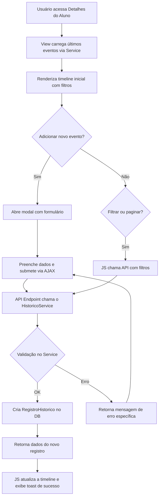

# Análise e Proposta de Melhoria para Módulos de Histórico do Projeto OmAum

**Autor:** Manus AI
**Data:** 04 de Outubro de 2025
**Versão:** 1.0

---

## 1. Introdução

Este documento apresenta uma análise detalhada e sistemática dos módulos de **Dados Iniciáticos**, **Histórico de Registros** e da funcionalidade de **Adicionar Eventos ao Histórico** do aplicativo `alunos` no projeto OmAum. A análise estende-se às suas interligações com os aplicativos `tipos_codigo` e `codigos_iniciaticos`.

O objetivo principal é identificar as causas da complexidade percebida no layout, nas regras de negócio e nos processos atuais, que dificultam a manutenção, o entendimento e a usabilidade do sistema. Com base nesta análise, são propostas sugestões concretas para refatoração, simplificação e melhoria da experiência do usuário (UX), visando um sistema mais robusto, intuitivo e de fácil manutenção.

## 2. Análise da Estrutura Atual

A análise do estado atual revela uma arquitetura com pontos de atrito significativos, originados de uma evolução incremental que não foi acompanhada de uma refatoração adequada. As complexidades foram categorizadas em arquiteturais, de regras de negócio, de interface e técnicas.

### 2.1. Mapeamento de Interligações

A interação entre os componentes é marcada por uma dualidade na fonte de dados e por fluxos de interação incompletos.

#### Arquitetura de Dados

O sistema utiliza duas fontes de dados para o histórico do aluno, o que representa o núcleo da complexidade arquitetural:

1.  **Modelo Relacional:** Uma tabela `RegistroHistorico` que possui chaves estrangeiras (FKs) para os modelos `Aluno` e `Codigo`, garantindo integridade referencial.
2.  **Campo JSON:** Um campo `historico_iniciatico` no modelo `Aluno`, que armazena uma lista desnormalizada de eventos, sem as garantias de um banco de dados relacional.

O fluxo de dados pretendido pode ser visualizado no seguinte diagrama:

```mermaid
graph TD
    subgraph Aplicativo "Tipos de Código"
        TipoCodigo["Modelo TipoCodigo<br>(Categorias: Cargos, Cursos)"]
    end
    subgraph Aplicativo "Códigos Iniciáticos"
        Codigo["Modelo Codigo<br>(Eventos específicos)"]
    end
    subgraph Aplicativo "Alunos"
        Aluno["Modelo Aluno"]
        RegistroHistorico["Modelo RegistroHistorico<br>(Tabela relacional)"]
        HistoricoJSON["Campo historico_iniciatico<br>(Campo JSON no Aluno)"]
    end

    TipoCodigo -- "1..N" --> Codigo
    Codigo -- "1..N" --> RegistroHistorico
    Aluno -- "1..N" --> RegistroHistorico
    Aluno -- "1..1" --> HistoricoJSON
```

#### Fluxos de Interação

Os fluxos de leitura e escrita de dados estão quebrados devido a endpoints de API não implementados ou não conectados, e à falta de uma camada de serviço para orquestrar as operações.

-   **Leitura (GET):** A tela de detalhes do aluno tenta carregar o histórico inicial a partir do campo JSON e, subsequentemente, deveria carregar o restante de forma paginada via API. No entanto, a API (`api_historico_aluno`) não possui a lógica de serviço necessária, resultando em uma experiência de 

carregamento infinita para o usuário.

-   **Escrita (POST):** A funcionalidade de adicionar um novo evento, que deveria ser a principal interação do usuário, está completamente inoperante. O código JavaScript no frontend está preparado para chamar uma API, mas a URL correspondente está comentada no template HTML, e a view do backend (`adicionar_evento_historico_ajax`) não possui a lógica para persistir os dados.

### 2.2. Identificação de Complexidades

A seguir, uma tabela que resume as principais dores e complexidades identificadas em cada perspectiva.

| Categoria | Problema Principal | Consequências Imediatas |
| :--- | :--- | :--- |
| **Arquitetura** | **Duplicação da Fonte de Verdade** (JSON vs. Relacional) | Risco de inconsistência de dados, queries duplicadas, e necessidade de uma lógica de sincronização complexa e não implementada. |
| | **Endpoints Incompletos e Desconectados** | Funcionalidades essenciais da interface não operam, gerando frustração no usuário e uma percepção de instabilidade do sistema. |
| | **Carregamento Dinâmico de Módulos (`importlib`)** | Degradação de performance em tempo de execução e dificulta o rastreamento de erros e a realização de testes unitários. |
| **Regras de Negócio** | **Coexistência de Estados Não Sincronizados** | O sistema pode apresentar dados diferentes para o mesmo aluno dependendo do método de consulta, tornando a informação pouco confiável. |
| | **Validações de Dados Dispersas** | Regras de negócio (ex: datas futuras, unicidade de OS) não são garantidas de forma centralizada no backend, abrindo brechas para a entrada de dados inválidos. |
| **Interface (UX)** | **Layout Alongado e Redundante** | O uso excessivo de acordeões e a duplicação de botões tornam a navegação confusa e aumentam a carga cognitiva do usuário. |
| | **Feedback Ausente ou Inadequado** | Ações críticas são executadas sem confirmação ou feedback de progresso/erro, resultando em uma experiência de usuário pobre e incerta. |
| **Técnica** | **Débito Técnico Explícito (TODOs)** | A presença de comentários `TODO` em pontos críticos do código, junto com a existência de variáveis não definidas, indica um trabalho inacabado e com alto risco de erros 500 em produção. |
| | **Dependências de CDN sem Fallback** | O sistema fica vulnerável a falhas de redes de terceiros, o que pode quebrar funcionalidades inteiras sem uma alternativa local. |

## 3. Sugestões de Melhoria e Refatoração

Para endereçar as complexidades identificadas, propõe-se uma estratégia de refatoração baseada em três pilares: **unificação da fonte de dados**, **centralização da lógica de negócio** e **melhoria progressiva da experiência do usuário**.

### 3.1. Estratégia de Refatoração

A estratégia é dividida em ações de curto e médio prazo, focando em uma abordagem incremental que entrega valor a cada etapa.

#### **Fase 1: Unificar a Fonte de Dados e Criar uma Camada de Serviço**

A prioridade máxima é eliminar a dualidade de fontes de dados. A proposta é eleger o **modelo relacional `RegistroHistorico` como a única fonte de verdade**.

1.  **Criar uma Camada de Serviço (`HistoricoService`):** Toda a lógica de negócio para criar, listar, atualizar e anular eventos do histórico deve ser centralizada em uma classe de serviço. Isso garante que as regras sejam aplicadas de forma consistente, seja a chamada originada de uma API, de um formulário Django ou de um script de gerenciamento.

2.  **Migrar Dados do JSON:** Desenvolver um script de migração (comando Django) para ler os dados do campo `historico_iniciatico` de cada aluno e persisti-los na tabela `RegistroHistorico`. Após a migração bem-sucedida, o campo JSON deve ser limpo e, eventualmente, removido (deprecated).

3.  **Implementar Auditoria:** Adicionar campos essenciais ao modelo `RegistroHistorico` para uma auditoria completa, como `criado_por`, `created_at`, `updated_at`, e campos para anulação (soft delete), como `ativo`, `anulado_por` e `motivo_anulacao`.

#### **Fase 2: Simplificar o Processo e a Experiência do Usuário (UX)**

Com a base do backend sólida, o foco se volta para a interface do usuário.

1.  **Redesenhar a Interface para uma Timeline:** Substituir a atual combinação de tabela estática e acordeões por um componente de **timeline vertical**. Este formato é naturalmente cronológico e mais intuitivo para visualizar um histórico de eventos.

2.  **Fluxo de Adição em Modal:** A adição de um novo evento deve ocorrer em uma janela modal, que contém um formulário limpo e com validações claras. A seleção de "Tipo de Código" deve carregar dinamicamente os "Códigos Iniciáticos" correspondentes, preferencialmente com uma funcionalidade de autocomplete para catálogos extensos.

3.  **Feedback Imediato:** Após a submissão do formulário, a interface deve ser atualizada dinamicamente (via JavaScript) para incluir o novo evento na timeline, sem a necessidade de recarregar a página. Toasts (pequenas notificações) devem ser usados para confirmar o sucesso ou informar erros.

### 3.2. Proposta de Novo Fluxo de Trabalho

O diagrama a seguir ilustra o fluxo de trabalho proposto, que é mais simples, robusto e centrado no usuário.



### 3.3. Roadmap de Implementação Sugerido

Propõe-se um roadmap incremental, dividido em sprints, para organizar a implementação das melhorias.

| Sprint | Foco Principal | Entregáveis Chave |
| :--- | :--- | :--- |
| **Sprint 1 (Fundação)** | Fazer o fluxo básico funcionar | - `HistoricoService` com métodos `criar_evento` e `listar_eventos`.<br>- Endpoints de API funcionais para adição e listagem.<br>- Testes unitários para a camada de serviço. |
| **Sprint 2 (Migração)** | Unificar a fonte de dados | - Script de migração de JSON para relacional.<br>- Validação da integridade dos dados migrados.<br>- Depreciação oficial do campo JSON. |
| **Sprint 3 (UX Redesign)** | Melhorar a experiência do usuário | - Nova interface em formato de timeline.<br>- Formulário de adição em modal com feedback em tempo real.<br>- Funcionalidade de filtros e paginação na timeline. |
| **Sprint 4 (Polimento)** | Otimização e refinamento | - Otimização de queries (N+1).<br>- Implementação de cache para catálogos.<br>- Documentação técnica e de usuário final atualizada. |

## 4. Conclusão

A complexidade atual dos módulos de histórico do projeto OmAum é um sintoma claro de débito técnico acumulado, principalmente devido à ausência de uma fonte de dados única e de uma camada de serviço bem definida. A coexistência de um modelo relacional e um campo JSON para a mesma finalidade cria um ambiente propenso a inconsistências, dificulta a manutenção e degrada a experiência do usuário com funcionalidades quebradas.

A implementação das sugestões propostas, seguindo o roadmap incremental, permitirá transformar a funcionalidade de um ponto de fragilidade em um exemplo de robustez e usabilidade no sistema. Ao centralizar a lógica de negócio, unificar os dados e redesenhar a interface com foco no usuário, o projeto OmAum ganhará em manutenibilidade, confiabilidade e satisfação do usuário, estabelecendo uma base sólida para futuras evoluções.

