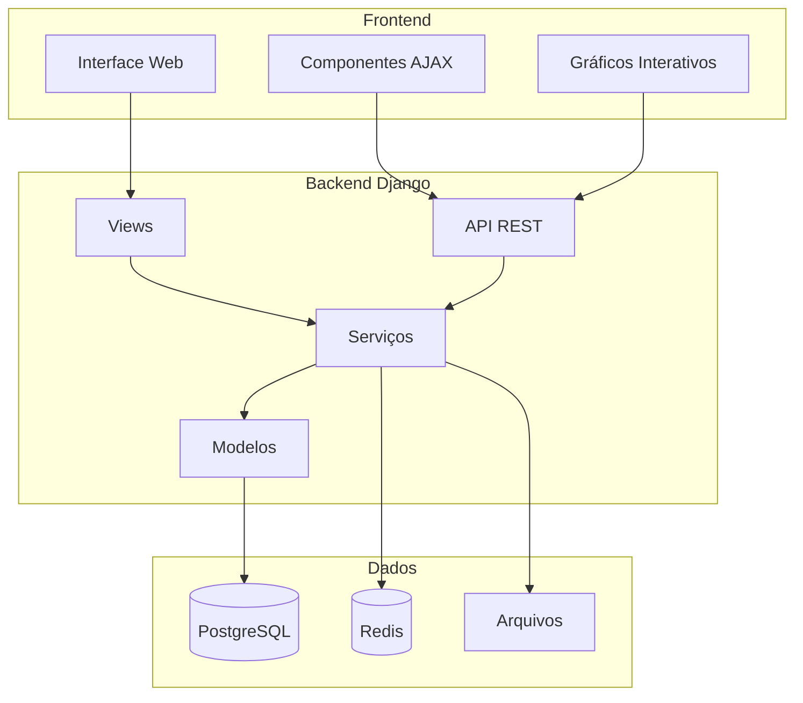
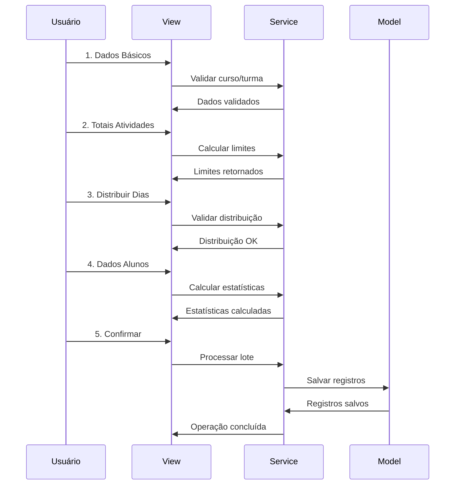
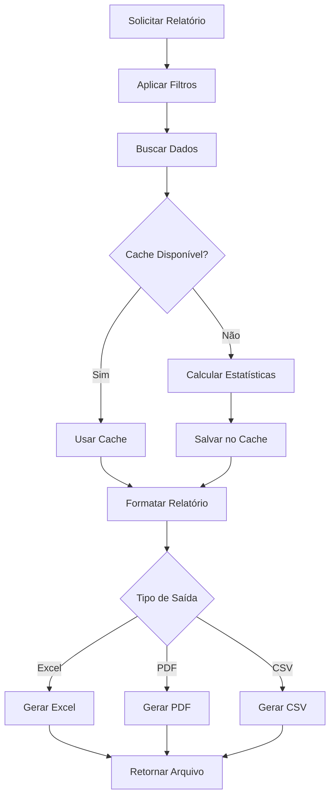

# Documentação do Sistema OMAUM

Bem-vindo à documentação completa do Sistema OMAUM - uma plataforma robusta para gestão acadêmica com foco em controle de presenças e frequência.

## 📋 Índice da Documentação

### 🎯 Para Usuários Finais
- **[📖 Manual do Usuário](MANUAL_USUARIO.md)**
  - Guia completo para professores e coordenadores
  - Tutoriais passo-a-passo
  - Interface e funcionalidades
  - Casos de uso práticos
  - FAQ e solução de problemas

### 🔧 Para Administradores
- **[⚙️ Guia de Instalação](GUIA_INSTALACAO.md)**
  - Pré-requisitos do sistema
  - Instalação passo-a-passo
  - Configuração inicial
  - Deploy em produção
  - Troubleshooting

### 👨‍💻 Para Desenvolvedores
- **[🏗️ Arquitetura do Sistema](ARQUITETURA_PRESENCAS.md)**
  - Visão geral da arquitetura
  - Padrões de design utilizados
  - Fluxo de dados
  - Decisões técnicas
  - Diagramas e estruturas

- **[💻 Guia do Desenvolvedor](GUIA_DESENVOLVEDOR.md)**
  - Estrutura do código
  - Padrões de desenvolvimento
  - Como contribuir
  - Testes e qualidade
  - Debugging e performance

- **[🔌 Documentação da API](API_DOCUMENTATION.md)**
  - Endpoints REST
  - Autenticação e segurança
  - Exemplos de uso
  - Rate limiting
  - Códigos de erro

### 📝 Histórico e Mudanças
- **[📋 Changelog](CHANGELOG.md)**
  - Histórico de versões
  - Mudanças e melhorias
  - Breaking changes
  - Roadmap futuro
  - Guias de migração

## 🎯 Sistema de Presenças - Funcionalidades Principais

### ✨ Destaques da Versão 2.0

#### 📊 Registro de Presenças
- **Multi-etapas**: Processo guiado em 5 etapas
- **Registro Rápido**: Interface AJAX otimizada
- **Validação Inteligente**: Múltiplas camadas de validação
- **Cálculos Automáticos**: Percentuais e carências em tempo real

#### 📈 Análises e Relatórios
- **Painel Interativo**: Gráficos dinâmicos com Chart.js
- **Exportação Avançada**: Excel profissional, PDF completo, CSV
- **Agendamento Automático**: Relatórios por email
- **Configurações Flexíveis**: Por turma e atividade

#### 🔗 Integração e API
- **API REST Completa**: Endpoints documentados
- **Autenticação Segura**: Token-based
- **Rate Limiting**: Controle de acesso
- **Versionamento**: APIs versionadas

## 🚀 Quick Start

### Para Usuários
1. Leia o [Manual do Usuário](MANUAL_USUARIO.md)
2. Acesse o sistema via navegador
3. Faça login com suas credenciais
4. Explore o menu de Presenças

### Para Desenvolvedores
1. Siga o [Guia de Instalação](GUIA_INSTALACAO.md)
2. Configure o ambiente de desenvolvimento
3. Leia o [Guia do Desenvolvedor](GUIA_DESENVOLVEDOR.md)
4. Execute os testes: `python manage.py test`

### Para Integradores
1. Consulte a [Documentação da API](API_DOCUMENTATION.md)
2. Obtenha token de autenticação
3. Teste endpoints em ambiente de desenvolvimento
4. Implemente seguindo as melhores práticas

## 📊 Arquitetura Geral

## 🔄 Fluxo de Trabalho Principal

### 1. Registro de Presença Multi-etapas

### 2. Geração de Relatórios

## 🎨 Princípios de Design

### 1. **Simplicidade**
- Interface intuitiva e limpa
- Fluxos de trabalho lógicos
- Feedback visual claro

### 2. **Performance**
- Consultas otimizadas
- Cache estratégico
- Paginação eficiente

### 3. **Flexibilidade**
- Configurações personalizáveis
- Múltiplos formatos de export
- API extensível

### 4. **Confiabilidade**
- Validações robustas
- Tratamento de erros
- Logs detalhados

### 5. **Escalabilidade**
- Arquitetura modular
- Componentes reutilizáveis
- Preparado para crescimento

## 🔧 Tecnologias Utilizadas

### Backend
- **Django 4.2+**: Framework web principal
- **Django REST Framework**: API REST
- **PostgreSQL**: Banco de dados (produção)
- **Redis**: Cache e sessões
- **Celery**: Processamento assíncrono

### Frontend
- **Bootstrap 5**: Framework CSS
- **jQuery**: Manipulação DOM
- **Chart.js**: Gráficos interativos
- **Select2**: Componentes avançados

### DevOps
- **Docker**: Containerização
- **Nginx**: Servidor web
- **GitHub Actions**: CI/CD
- **Monitoring**: Logs e métricas

## 📈 Métricas e KPIs

### Performance
- **Tempo de resposta**: < 200ms (média)
- **Uptime**: 99.9%
- **Throughput**: 1000+ req/min

### Uso
- **Usuários ativos**: Professores e coordenadores
- **Registros processados**: Milhares por mês
- **Relatórios gerados**: Centenas por semana

### Qualidade
- **Cobertura de testes**: 80%+
- **Code coverage**: 85%+
- **Bugs críticos**: < 1/mês

## 🛣️ Roadmap

### Próximas Versões

#### v2.1 (Q1 2024)
- [ ] Notificações push
- [ ] Relatórios com IA
- [ ] App mobile (beta)
- [ ] Integração Google Calendar

#### v2.2 (Q2 2024)
- [ ] Dashboard executivo
- [ ] Auditoria avançada
- [ ] Backup automático
- [ ] Performance monitoring

#### v3.0 (Q4 2024)
- [ ] Microserviços
- [ ] GraphQL API
- [ ] Machine Learning
- [ ] Multi-tenancy

## 🤝 Contribuindo

### Como Contribuir

1. **Issues**: Reporte bugs ou sugira features
2. **Pull Requests**: Contribua com código
3. **Documentação**: Melhore a documentação
4. **Testes**: Adicione cobertura de testes

### Convenções

- **Commits**: Conventional Commits
- **Código**: PEP 8 e Django best practices
- **Testes**: 80%+ coverage obrigatório
- **Documentação**: Docstrings obrigatórias

## 📞 Suporte

### Canais de Contato

- **📧 Email**: suporte@omaum.edu.br
- **🐛 Issues**: GitHub Issues
- **💬 Discussões**: GitHub Discussions
- **📖 Wiki**: Documentação completa

### SLA de Suporte

- **Bugs críticos**: 24h
- **Bugs normais**: 72h
- **Features**: Conforme roadmap
- **Dúvidas**: 48h

---

**Sistema OMAUM - Gestão Acadêmica Inteligente**

*Desenvolvido com ❤️ para a comunidade educacional*

[🌟 Dar Star](https://github.com/lcsilv3/omaum) | [📖 Documentação](README.md) | [🚀 Demo](https://demo.omaum.edu.br)

---

*Última atualização: Janeiro 2024 | Versão: 2.0.0*
